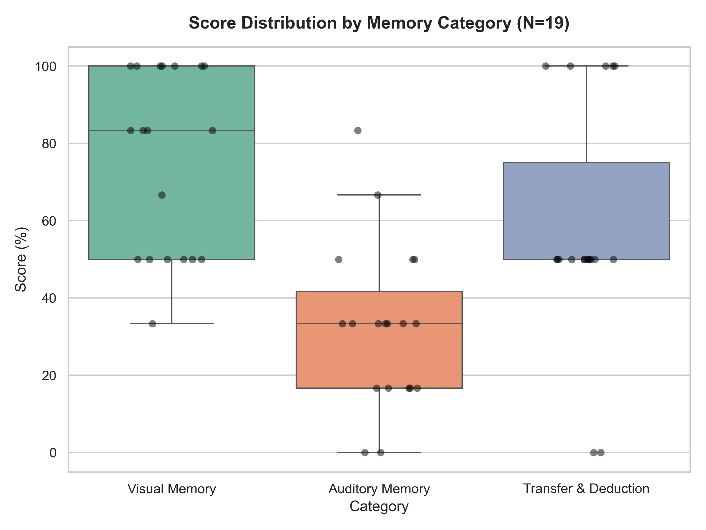
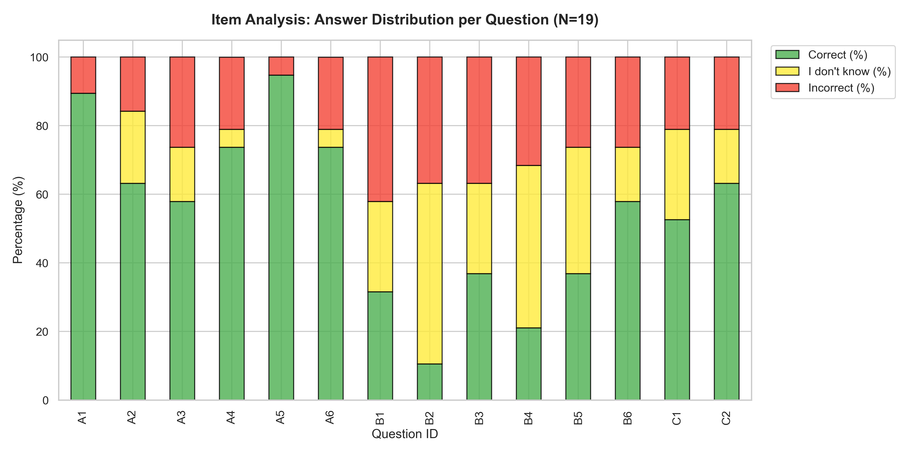

# User Study Evaluation Report

This report summarizes the performance and recall analysis of **19 participants** in the *Eyes On Me* user study.

---

## 1. Executive Summary

- **Total Participants:** 19 unique participants (first attempts only).
- **Average Performance:** The overall mean score was **54.51%** (SD = 17.20%), which corresponds to recalling **7.63 out of 14** details correctly.
- **Hypothesis Testing:**
  - Participants performed **significantly better than chance** (one-sample t-test vs 25% baseline, p < 0.001), indicating high attentiveness and successful encoding of game details.
  - A statistically highly significant difference was found between Visual and Auditory recall performance (Wilcoxon signed-rank test, p < 0.001), indicating that visual memory recall (Mean = 75.4%) was substantially better than auditory memory recall (Mean = 32.5%).

---

## 2. Descriptive Statistics

| Score Category | Mean (%) | Median (%) | SD (%) | Max Correct |
| --- | --- | --- | --- | --- |
| **Total Score (out of 14)** | 54.51% | 57.14% | 17.20% | 12/14 |
| **Visual Memory (out of 6)** | 75.44% | 83.33% | 23.81% | 6/6 |
| **Auditory Memory (out of 6)** | 32.46% | 33.33% | 21.14% | 5/6 |
| **Transfer & Deduction (out of 2)** | 57.89% | 50.00% | 30.11% | 2/2 |

*Note: SD (Standard Deviation) measures score dispersion around the mean; a higher SD indicates greater variation in performance among participants.*

### Score Distributions Chart
The boxplot and individual scores can be viewed here:

*Note on reading the chart: The box outlines the Interquartile Range (middle 50% of participants), the horizontal line inside the box is the median, and the whiskers show the overall range of scores. Black dots represent individual participant scores.*

---

## 3. Statistical Analysis

### Wilcoxon Signed-Rank Test (Visual vs. Auditory)
- **Objective:** To determine whether participants recalled visual elements differently from auditory elements.
- **Result:** Wilcoxon $W$ = 2.00, $p$ = 0.0003.
- **Interpretation:** There is a highly significant difference between visual and auditory memory scores, with visual recall being substantially stronger.

### One-Sample t-Test against Chance
- **Objective:** Verify if participants' scores were due to random guessing (25% chance).
- **Result:** $t(18)$ = 7.48, $p$ = 0.0000.
- **Interpretation:** Participants performed significantly above the guessing rate, showing successful memory retrieval.

### Correlation Analysis
- **Objective:** Examine the relationship between visual and auditory recall.
- **Result:** Spearman's $
ho$ = 0.35, $p$ = 0.1374.
- **Interpretation:** There was no strong or significant correlation between visual and auditory memory scores.

---

## 4. Item Analysis (Difficulty & Avoidance)

The following table breaks down the response behavior for each of the 14 questions, sorted by category:

| Question ID | Category | Correct (%) | Incorrect (%) | "I don't know" (%) |
| --- | --- | --- | --- | --- |
| A1 | Visual | 89.47% | 10.53% | 0.0% |
| A2 | Visual | 63.16% | 15.79% | 21.05% |
| A3 | Visual | 57.89% | 26.32% | 15.79% |
| A4 | Visual | 73.68% | 21.05% | 5.26% |
| A5 | Visual | 94.74% | 5.26% | 0.0% |
| A6 | Visual | 73.68% | 21.05% | 5.26% |
| B1 | Auditory | 31.58% | 42.11% | 26.32% |
| B2 | Auditory | 10.53% | 36.84% | 52.63% |
| B3 | Auditory | 36.84% | 36.84% | 26.32% |
| B4 | Auditory | 21.05% | 31.58% | 47.37% |
| B5 | Auditory | 36.84% | 26.32% | 36.84% |
| B6 | Auditory | 57.89% | 26.32% | 15.79% |
| C1 | Transfer | 52.63% | 21.05% | 26.32% |
| C2 | Transfer | 63.16% | 21.05% | 15.79% |

### Question Analysis Chart
The stacked bar chart below displays the response distribution for each question:

---

## 5. Key Findings & Discussion

1. **Modal Recall Asymmetry (Visual vs. Auditory):**
   - There is a massive, statistically significant difference between visual memory recall (75.4%) and auditory memory recall (32.5%, p < 0.001). 
   - This asymmetry strongly suggests that visual information in the environment (which was static and persistent on the desk or walls) was encoded much more effectively than transient auditory cues (which were spoken by the avatar).
   - Additionally, the gameplay mechanics (monitoring the avatar's eye contact and managing suspicion) likely created high cognitive load during Vane's speech, interfering with auditory encoding, while visual clues could be scanned safely when Vane looked away.

2. **Question Difficulty:**
   - **Easiest Questions:** **A5** (Visual, 94.74% correct), **A1** (Visual, 89.47% correct), **A4** (Visual, 73.68% correct).
   - **Hardest Questions:** **B2** (Auditory, 10.53% correct), **B4** (Auditory, 21.05% correct), **B1** (Auditory, 31.58% correct).
   - The extremely low score on **B2** (15.79% correct) and **B4** (26.32% correct) indicates that participants struggled significantly to remember spoken details (such as the cargo vessel's name or the rogue contact's name).

3. **"I don't know" Usage and Meta-Memory:**
   - High "I don't know (%)" rates on difficult questions, such as B2 (47.37%) and B4 (42.11%), demonstrate that participants were highly aware of their memory gaps and chose the safe option rather than guessing blindly.
   - This suggests that the presence of the "I don't know" option successfully reduced random noise in the data, which increases the scientific reliability of the scores.

## Case Study: Learning Effect (Multiple Attempts)

Participant **MarkusK** completed the study twice:
- **Attempt 1:** 6/14 (42.9%)
- **Attempt 2:** 14/14 (100.0%)
- **Improvement:** +8 correct answers.

| Question | Category | Attempt 1 Answer | Attempt 2 Answer | Correct Option Index |
| --- | --- | --- | --- | --- |
| A1 | Visual | Correct ✅ | Correct ✅ | 3 |
| A2 | Visual | I don't know 🤷 | Correct ✅ | 1 |
| A3 | Visual | I don't know 🤷 | Correct ✅ | 2 |
| A4 | Visual | Wrong ❌ | Correct ✅ | 1 |
| A5 | Visual | Correct ✅ | Correct ✅ | 0 |
| A6 | Visual | Wrong ❌ | Correct ✅ | 3 |
| B1 | Auditory | Wrong ❌ | Correct ✅ | 1 |
| B2 | Auditory | I don't know 🤷 | Correct ✅ | 1 |
| B3 | Auditory | Correct ✅ | Correct ✅ | 2 |
| B4 | Auditory | I don't know 🤷 | Correct ✅ | 3 |
| B5 | Auditory | Correct ✅ | Correct ✅ | 2 |
| B6 | Auditory | Correct ✅ | Correct ✅ | 3 |
| C1 | Transfer | Correct ✅ | Correct ✅ | 2 |
| C2 | Transfer | I don't know 🤷 | Correct ✅ | 1 |

*Note: The Correct Option Index refers to the 0-based index of the correct answer choice in the questionnaires.json configuration file.*

